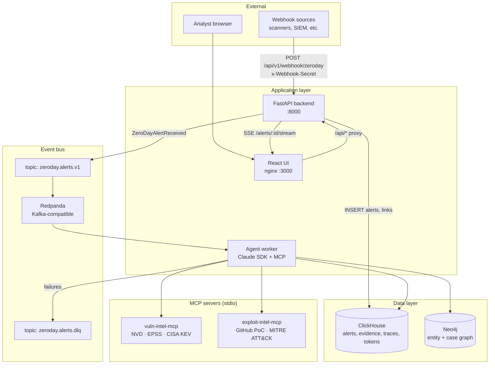
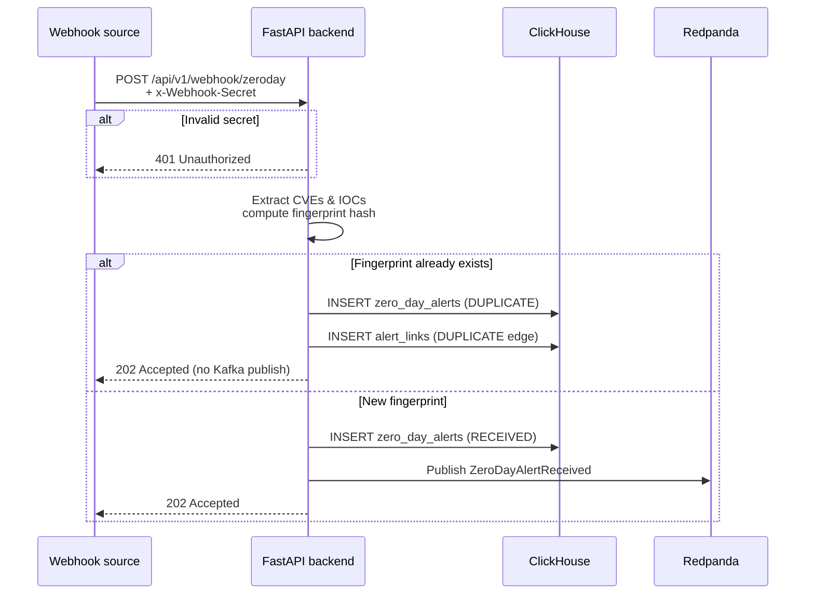
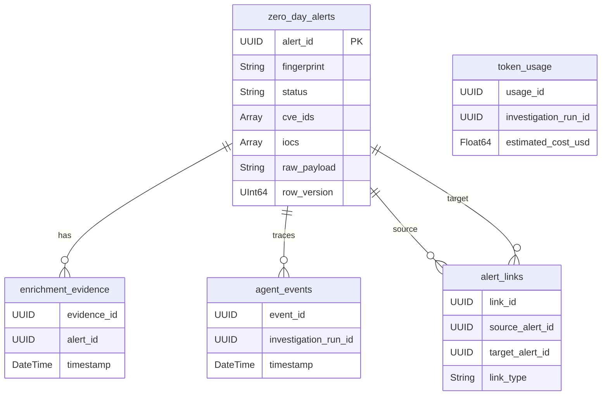

# Zero-Day Investigation Agent (ZIA)

A production-style, agentic zero-day investigation pipeline. Ingests raw vulnerability alerts from arbitrary third parties via webhook, normalizes them, deduplicates them, persists them, and triggers an autonomous AI agent (built on the **Claude Agent SDK**) that performs end-to-end enrichment, correlation, severity scoring, and executive reporting. The entire investigation is visible in a web UI as it happens.

## Architecture overview



## Quick start

### 1. Connect to the LiteLLM proxy service for free LLM model use.

### 2. Start the full stack

```bash
docker compose up -d --build
```

### 3. Open the UI

```
http://localhost:3000          # Alerts Dashboard (auto-refresh every 5s)
http://localhost:3000/submit   # Submit Alert page
```

### 4. Run infrastructure checks

```bash
python3 -m venv .venv && source .venv/bin/activate
pip install -r requirements-verify.txt
python verify_infra.py
```

### 5. Run integration tests

```bash
./scripts/run_integration_tests.sh
# or
pytest test_webhook.py test_agent_worker.py -v
```

---

## Ingestion flow (Phase 2)

What happens when a webhook payload arrives:



Design rules:
- **202 Accepted** — API never waits on enrichment or the agent worker.
- **Append-only ClickHouse** — status updates use new rows (see ClickHouse pattern below).
- **Dedup** — `fingerprint = SHA256(sorted_cves | sorted_iocs)`; duplicates skip the event bus.

---

## ClickHouse — mutable state on an append-only store

ClickHouse does not support `UPDATE` statements for high-throughput workloads. Instead, ZIA uses the **`ReplacingMergeTree` + `FINAL` / `argMax` pattern** to model mutable alert state on top of an append-only event log.

### How it works

`zero_day_alerts` uses `ReplacingMergeTree(row_version)`. Every status change (e.g. `RECEIVED → ENRICHING → SCORING → COMPLETED`) is written as a **new INSERT row** with a higher `row_version` (millisecond Unix timestamp). ClickHouse deduplicates in the background, keeping only the row with the highest `row_version` per `alert_id`.

```sql
-- Always read the latest state per alert using FINAL:
SELECT alert_id, status, severity, composite_priority_score
FROM zero_day_alerts
FINAL
ORDER BY created_at DESC;

-- Or use argMax for a specific field without FINAL:
SELECT
    alert_id,
    argMax(status, row_version)     AS current_status,
    argMax(severity, row_version)   AS current_severity
FROM zero_day_alerts
GROUP BY alert_id;
```

### Why not UPDATE?

ClickHouse is optimised for bulk inserts and analytical queries. Mutations (`ALTER TABLE ... UPDATE`) are expensive async operations, not OLTP-style writes. By treating every state transition as a new event row, we:

1. Preserve the full audit trail (replay, debug, backfill).
2. Maintain ClickHouse's write throughput and columnar compression.
3. Can query point-in-time state by filtering on `row_version`.

The `FINAL` modifier triggers synchronous deduplication at query time — suitable for low-frequency reads like the UI dashboard. For real-time SSE streaming, queries target `agent_events` (which is a plain `MergeTree`, append-only, no dedup needed).

---

## Composite Priority Score (CPS) formula

CPS is a 0–100 score derived from six weighted signals (all data from free APIs):

```
CPS = w1 * CVSS_normalized        // CVSS v3.1 base score / 10  → [0, 1]
    + w2 * EPSS_probability        // FIRST EPSS 30-day exploit probability
    + w3 * KEV_listed              // 1 if in CISA Known Exploited Vulnerabilities
    + w4 * public_exploit_exists   // 1 if PoC found on GitHub
    + w5 * asset_exposure          // exposed_assets / total_assets from inventory
    + w6 * threat_actor_severity   // 0.8 if named actor present, else 0.3
```

**Default weights** (tune in `worker.py::compute_cps`):

| Weight | Signal | Value |
|--------|--------|-------|
| w1 = 0.25 | CVSS v3.1 | normalised 0–1 |
| w2 = 0.25 | EPSS probability | already 0–1 |
| w3 = 0.20 | CISA KEV listed | 0 or 1 |
| w4 = 0.10 | Public exploit found | 0 or 1 |
| w5 = 0.15 | Asset exposure | fraction of internet-exposed assets |
| w6 = 0.05 | Named threat actor | 0.8 if present, 0.3 otherwise |

**Severity bands:**

| Band | CPS range |
|------|-----------|
| Critical | ≥ 80 |
| High | 60 – 79 |
| Medium | 40 – 59 |
| Low | < 40 |

---

## MCP servers

ZIA runs two custom stdio MCP servers. They implement the MCP protocol using `mcp.server.fastmcp` and communicate with the agent worker over stdin/stdout (no network socket).

### Server 1 — `vuln-intel-mcp` (`mcp-tools/vuln-intel-mcp.py`)

| Tool | Source | What it returns |
|------|--------|----------------|
| `lookup_cve(cve_id)` | NVD API 2.0 | CVSS v3.1 score, CWE, references |
| `get_epss_score(cve_id)` | FIRST EPSS API | 30-day exploit probability + percentile |
| `check_kev(cve_id)` | CISA KEV JSON feed | Is it in the KEV catalog? Date added, required action |

All free, no API key required (NVD has a higher rate limit with an optional key).

### Server 2 — `exploit-intel-mcp` (`mcp-tools/exploit-intel-mcp.py`)

| Tool | Source | What it returns |
|------|--------|----------------|
| `find_public_exploits(cve_id)` | GitHub Search API | Public PoC/exploit repositories, star count |
| `map_to_attack(cve_or_description)` | MITRE ATT&CK JSON | Matching technique IDs, names, tactics, scores |
| `lookup_actor(actor_name)` | MITRE ATT&CK JSON | Intrusion-set profile, aliases, associated TTPs |

GitHub rate limit is 60 req/hour unauthenticated; set `GITHUB_TOKEN` in `.env` for 5,000 req/hour.

### Pointing Claude Desktop at the MCP servers

Add to `~/Library/Application Support/Claude/claude_desktop_config.json`:

```json
{
  "mcpServers": {
    "vuln-intel": {
      "command": "python",
      "args": ["/path/to/ZIA/mcp-tools/vuln-intel-mcp.py"]
    },
    "exploit-intel": {
      "command": "python",
      "args": ["/path/to/ZIA/mcp-tools/exploit-intel-mcp.py"]
    }
  }
}
```

---

## Dead Letter Queue (DLQ) pattern

When the agent worker fails to process a Kafka message (unhandled exception, ClickHouse write error, MCP timeout, etc.), it:

1. Publishes the original event + failure reason to `zeroday.alerts.dlq` (via the built-in DLQ producer).
2. Attempts to write a `FAILED` status row to ClickHouse so the UI shows the failure.
3. Logs the error to stdout for Docker log collection.

The DLQ message format:
```json
{
  "original_event": { "event_type": "ZeroDayAlertReceived", "alert_id": "...", "payload": {} },
  "failure_reason": "HTTPError: NVD API 503",
  "failed_at": "2026-06-02T12:00:00Z"
}
```

To retry: consume `zeroday.alerts.dlq` and republish to `zeroday.alerts.v1`. No changes to the worker code needed — it will re-process the original event.

---

## Alert pipeline stages

| Status | Description |
|--------|-------------|
| `RECEIVED` | Webhook accepted, case created in ClickHouse |
| `NORMALIZED` | CVEs, IOCs, and fingerprint extracted |
| `DEDUP_CHECK` | Fingerprint matched against existing cases |
| `ENRICHING` | MCP tool calls running: NVD, EPSS, KEV, GitHub, ATT&CK |
| `SCORING` | Composite Priority Score being computed |
| `COMPLETED` | Executive summary written, case fully closed |
| `DUPLICATE` | Fingerprint matched — linked to canonical case, enrichment skipped |
| `FAILED` | Unhandled error — original event published to DLQ topic |

---

## ClickHouse tables



| Table | Engine | Purpose |
|-------|--------|---------|
| `zero_day_alerts` | ReplacingMergeTree(row_version) | Mutable alert state; fingerprint dedup |
| `enrichment_evidence` | MergeTree | Tool-call artifacts, one row per call |
| `agent_events` | MergeTree | Live agent trace log, streamed via SSE |
| `token_usage` | MergeTree | LLM cost telemetry (input/output/cache) |
| `alert_links` | MergeTree | Dedup & correlation edges |

---

## Webhook API

**Endpoint:** `POST /api/v1/webhook/zeroday`

**Auth:** `x-Webhook-Secret` header (value from `WEBHOOK_SECRET` env var). Returns `401` if the header is missing, wrong, or if `WEBHOOK_SECRET` is not configured on the server.

**Body:** arbitrary JSON, free-form text, or markdown — the normalizer figures out the shape.

```bash
curl -X POST http://localhost:8000/api/v1/webhook/zeroday \
  -H "Content-Type: application/json" \
  -H "x-Webhook-Secret: ${WEBHOOK_SECRET}" \
  -d '{"title":"Test alert","details":{"cve":"CVE-2024-9999","indicator":"192.0.2.1"}}'
```

**Response (new alert):**
```json
{
  "alert_id": "550e8400-e29b-41d4-a716-446655440000",
  "status": "RECEIVED",
  "fingerprint": "a1b2c3...",
  "duplicate": false
}
```

**Response (duplicate):**
```json
{
  "alert_id": "...",
  "status": "DUPLICATE",
  "fingerprint": "a1b2c3...",
  "canonical_alert_id": "550e8400-...",
  "duplicate": true
}
```

---

## Dashboard API

**Endpoint:** `GET /api/v1/alerts`

| Query param | Description |
|-------------|-------------|
| `status` | Filter by pipeline status |
| `severity` | Filter by severity band |
| `limit` | Max rows (default 100, max 500) |

**Endpoint:** `GET /api/v1/alerts/{alert_id}` — full case detail (alert, payload, evidence, timeline, token usage, duplicate link).

**Endpoint:** `GET /api/v1/alerts/{alert_id}/stream` — SSE stream of `agent_event` messages. Sends a `done` event when the alert reaches a terminal status.

---

## Ports & credentials

| Service | Host port(s) | Notes |
|---------|--------------|-------|
| ClickHouse | 8123 (HTTP), 9000 (native) | DB `zia`, user `zia` |
| Redpanda | 19092 (Kafka), 9644 (admin) | Topic `zeroday.alerts.v1`, DLQ `zeroday.alerts.dlq` |
| Neo4j | 7474 (browser), 7687 (Bolt) | user `neo4j` |
| Backend | 8000 | FastAPI |
| UI | 3000 | nginx → backend `/api/` |
| LiteLLM proxy | 4000 (via port-forward) | `host.docker.internal:4000` from containers |

Development passwords are in [`.env`](.env). **Do not use in production.**

---

## Testing

| Script | What it checks |
|--------|----------------|
| `verify_infra.py` | ClickHouse, Redpanda, Neo4j up; 5 tables exist |
| `test_webhook.py` | 202 latency, RECEIVED row, Kafka event, DUPLICATE dedup, 401 |
| `test_agent_worker.py` | Worker E2E: Kafka consume, Neo4j graph, ClickHouse traces, COMPLETED status |

```bash
./scripts/run_integration_tests.sh
```

---

## Tear down

```bash
docker compose down      # stop containers, keep volumes
docker compose down -v   # stop and delete data volumes
```

---

## Repository layout

```
ZIA/
├── docker-compose.yml          # Full local stack
├── schema.sql                  # ClickHouse DDL
├── asset_inventory.json        # ~50 synthetic assets for CPS scoring
├── verify_infra.py             # Phase 1 health checks
├── test_webhook.py             # Phase 2 integration tests
├── test_agent_worker.py        # Phase 4 worker E2E tests
├── mcp-tools/
│   ├── vuln-intel-mcp.py       # NVD · EPSS · CISA KEV (stdio MCP server)
│   └── exploit-intel-mcp.py   # GitHub PoC · MITRE ATT&CK (stdio MCP server)
├── services/
│   ├── backend/app/            # FastAPI ingestion + alerts API
│   ├── agent-worker/           # Kafka consumer + Claude SDK agent loop
│   └── ui/                     # Single-page React app (served by nginx)
└── scripts/
    └── run_integration_tests.sh
```
